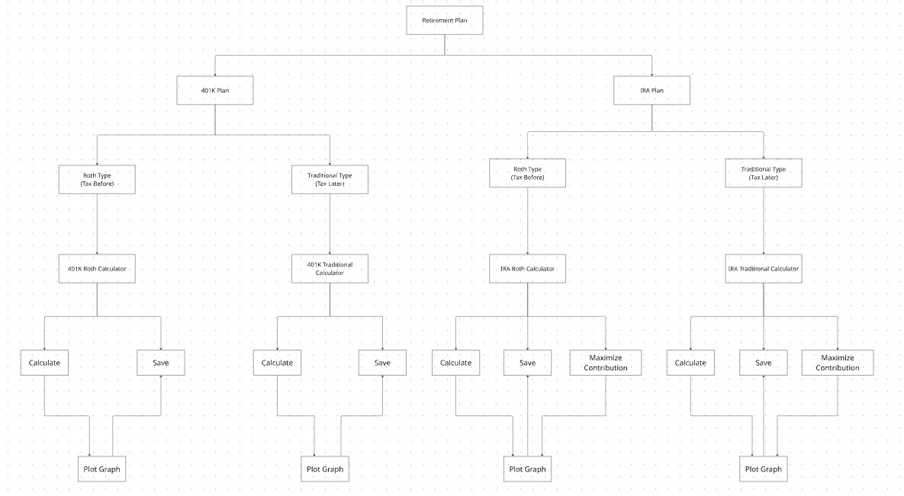
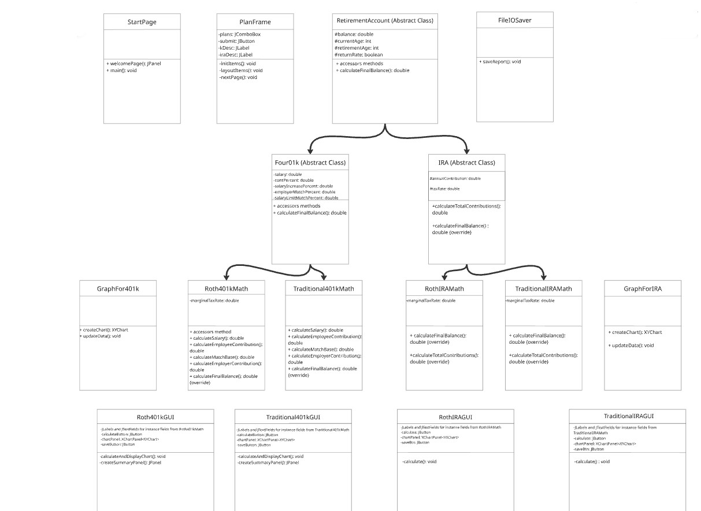
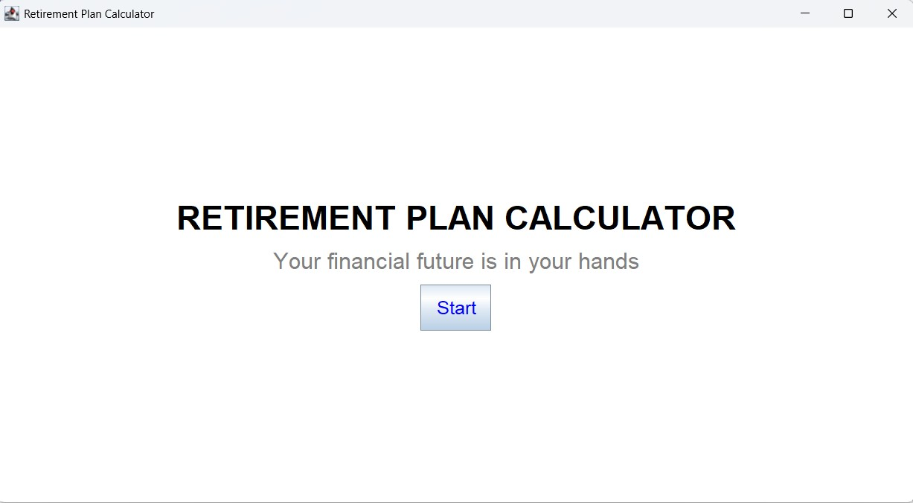
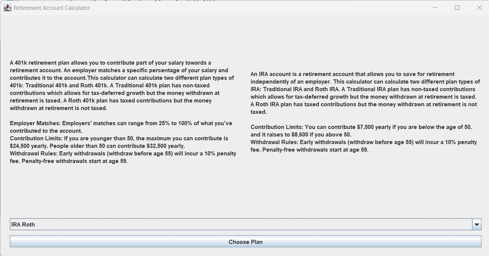
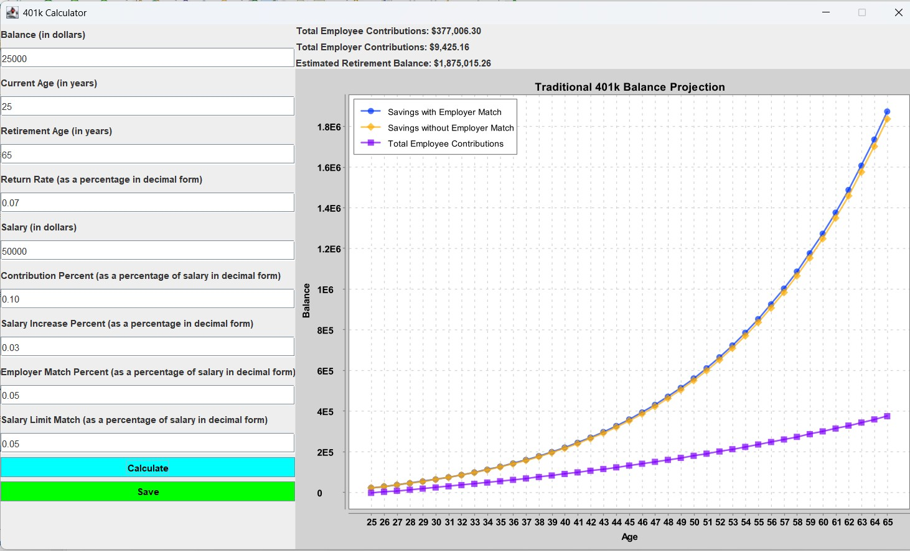
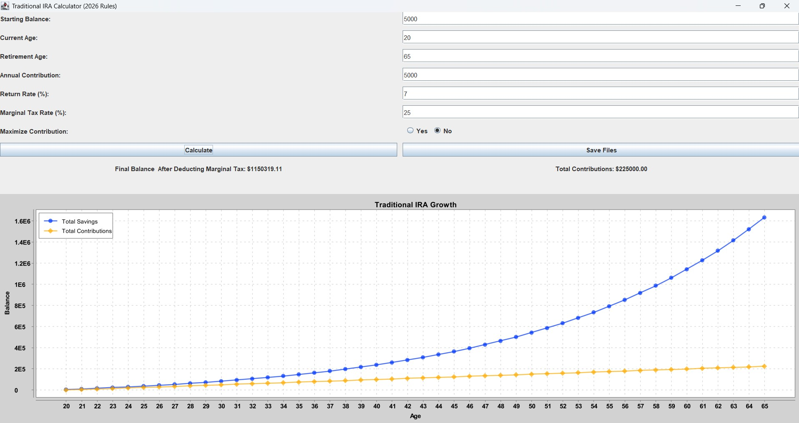
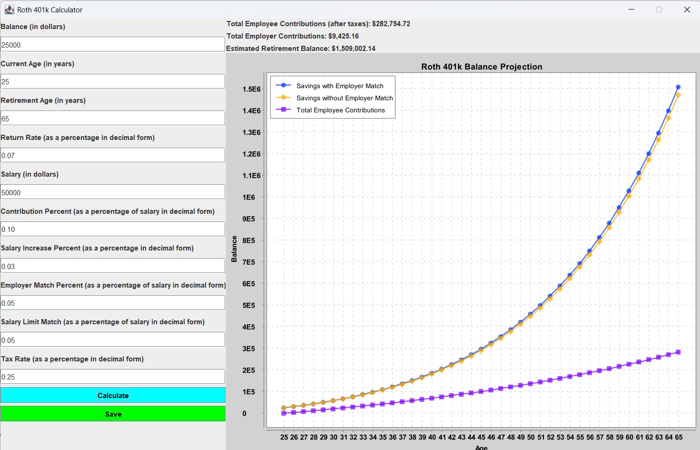
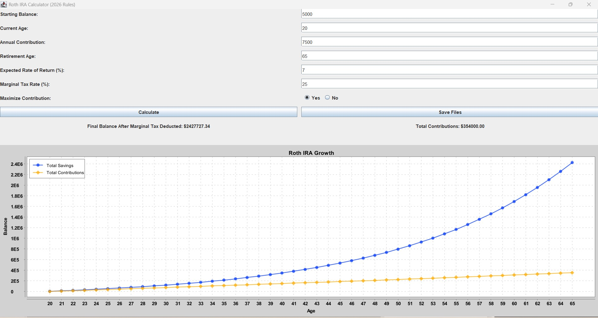

# Retirement Plan Calculator App
This project is a Retirement Plan Calculator, which is a Java desktop application developed as a group project with 4 members to help users estimate and compare different accounts across Traditional 401(k), Roth 401(k), Traditional IRA, and Roth IRA plans to choose a plan that is suitable for them.

 

Built with Java Swing and AWT, the application allows users to enter financial information to calculate projected retirement savings, save their graphical data, and visualize their retirement growth using XChart. For the code to work and the graph to be visible you need to download the xchart-3.8.8.jar or a later version and import it into your external JAR libraries in your compiler.

## My Contribution
I contributed to both the development and design of the application. My main contributions were:

 

•	Developed both the Traditional IRA and Roth IRA calculators and their mathematical calculation logic.

 

•	Implemented the save functionality for user data with Java file I/O.

 

•	Coded the graphs using XChart (3.8.8) for Traditional IRA and Roth IRA.

 

•	Researched and worked with my teammates on mathematical logic behind the retirement plan calculator for the IRA and 401(k) accounts.

 

•	Created the flowchart for the project.

 

•	Contributed to the UML class diagram for the project.

 

## Technologies used
•	Java

 

•	Java Swing & AWT

 

•	XChart 3.8.8

 

•	Java File I/O

 

•	Object-Oriented Programming

 

• Exception Handling 

 

### Application Flowchart

### UML Class Diagram

### Project Screenshots

| Welcome Page | Calculator Selection Screen |
| :---: | :---: |
| |  |

### Traditional Plans

| Traditional 401(k) | Traditional IRA |
| :---: | :---: |
|  |  |

### Roth Plans

| Roth 401(k) | Roth IRA |
| :---: | :---: |
|  |  |

